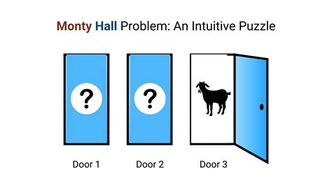

# Monty Hall Problem Simulation



## Table of Contents
- [Description](#description)
- [Project Structure](#project-structure)
- [Features](#features)
- [Requirements](#requirements)
- [Installation](#installation)
- [Usage](#usage)
- [Author](#author)
- [License](#license)

## Description
The Monty Hall Problem is a famous probability puzzle named after the host of the television game show "Let's Make a Deal". The problem goes as follows:

1. There are three doors, behind which are two goats and one car
2. The contestant picks a door (call it Door A)
3. The host, who knows what's behind each door, opens one of the other doors (Door B) to reveal a goat
4. The contestant is then given the option to stick with Door A, or switch to the remaining unopened door (Door C)

This simulation proves that switching doors gives you a ~66.7% chance of winning, while staying with your initial choice gives you only a ~33.3% chance. The program runs thousands of simulations to demonstrate this counter-intuitive mathematical truth.

## Project Structure
```
Monty-Hall-Simulation/
│
├── src/
│   └── main.py
│
├── assets/
│   └── picture.jpg
├── README.md
└── .gitignore
```

## Features
- Simulates individual Monty Hall game scenarios
- Runs multiple iterations to calculate win probabilities
- Compares winning rates between switching and staying strategies
- Includes assertion tests to verify the probability theory
- Provides clear statistical output of results

## Requirements
No external dependencies are required. The project uses only Python's standard library:
- Python 3.6+
- random (built-in module)

## Installation
1. Clone the repository:
```bash
git clone https://github.com/yourusername/Monty-Hall-Simulation.git
cd Monty-Hall-Simulation
```

## Usage
Run the simulation using Python:
```bash
python src/main.py
```

The program will output the win rates for both switching and staying strategies after running 100,000 simulations.

Example output:
```
Monty Hall Game Simulation
Switching: 0.67
Staying: 0.33
```

## Author
### Mohammadreza Naseri

## License
This project is licensed under the MIT License - see the [LICENSE](LICENSE) file for details.